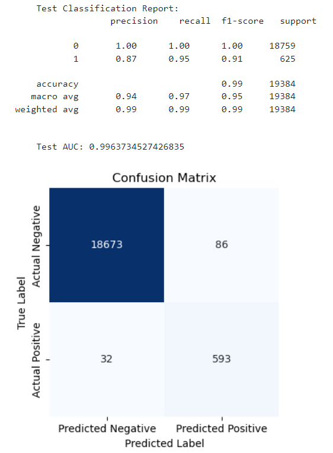

# dabc_challenge_20.supervised_ml
Module 20 - Supervised Machine Learning homework

## Overview of the Analysis

In this challenge, I used supervised machine learning techniques to train and evaluate a model that can label potential loan borrowers based on risk of default. The dataset consists of lending history from a lending services company.

In the credit_risk_classification_linear.ipynb notebook, the steps I used to evaluate and scale the data, train a LogisticRegression model, and evaluate the model are separated and labeled. You can see in the correlation heatmap that the variables correlated to my target, loan_status, are highly collinear, meaning that the linear model chosen for classification should work well with this dataset. 

Correlation Heatmap

I separated loan_status from the dataframe to use as my target and used the train_test_split function to keep 75% of my data for training and save 25% for testing. The LogisticRegression model was fit to the training data and executed on the testing data, the results of which are visualized in a confusion matrix and a classification report. I also plotted the Receiver Operating Characteristic (ROC) curve to show true positive versus false positive prediction rates for this model. 

Logistic Regression Model Results

In my second notebook, credit_risk_classification_multiple_models.ipynb, I used the same steps to evaluate, scale, and split the data for training and testing. Then I created a function to train and test different models and generate metrics for each. I included the same LogisticRegression model as in the previous notebook,followed by additional models including DecisionTree, RandomForest, Support Vector Machine, K-Nearest Neighbors, ExtraTrees Classifier, Adaptive Boost Classifier, Gradient Boosting Classifier, Extra Gradient Boost Classifier, and Light Gradient Boost Classifier. 

## Results

Most of these models produced similar results, likely due to the imbalance in the data -- only 3.224% of borrowers in the dataset defaulted on their loans, so the models all showed some amount of overfitting as they would learn much more about the users with healthy loans. 

The model with the best scores was Adaptive (Ada)Boost, and the results below can be compared with those of the LogisticRegression model above. AdaBoost performed a little better than the LogisticRegression. While both had near perfect scores for predicting healthy loans, the AdaBoost model had slightly higher accuracy for labeling recipients likely to default on their loans. 

AdaBoost Model Results

The ROC curves for both appear to be perfect with AUC=1, but we know from the metrics that each model scores just below 1. Again, the models appear close to perfect, likely because of the imbalance in the data.

AdaBoost ROC Curve

## Summary

For the lending company, I would recommend the AdaBoost model over the LogisticRegression model, though both performed well on this dataset. If the data were explanded to include more borrowers who defaulted on their loans, then I believe AdaBoost would perform even better because it weights the data based on feature importance in order to reduce overfitting.  More of my analysis can be found at the end of each notebook.

In this case, accurate predictions of the borrowers likely to default might be more important to the lending company than accurate predictions of healthy loans, and of all the models tested here, AdaBoost provided the lowest percentages of false positive and false negative scores. 

